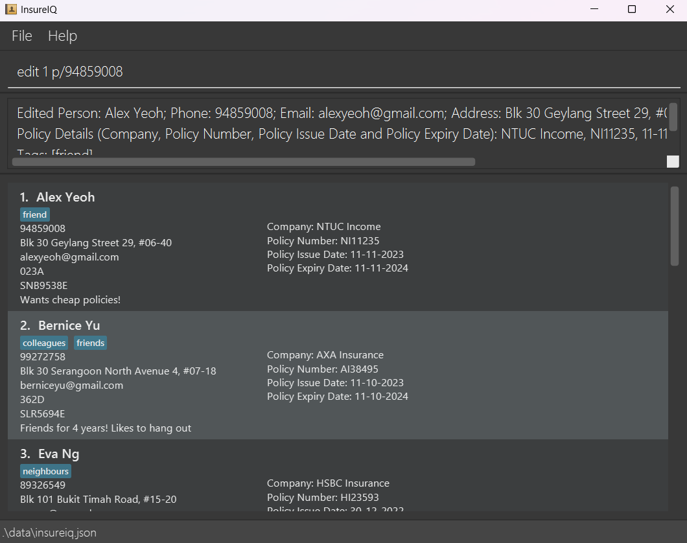
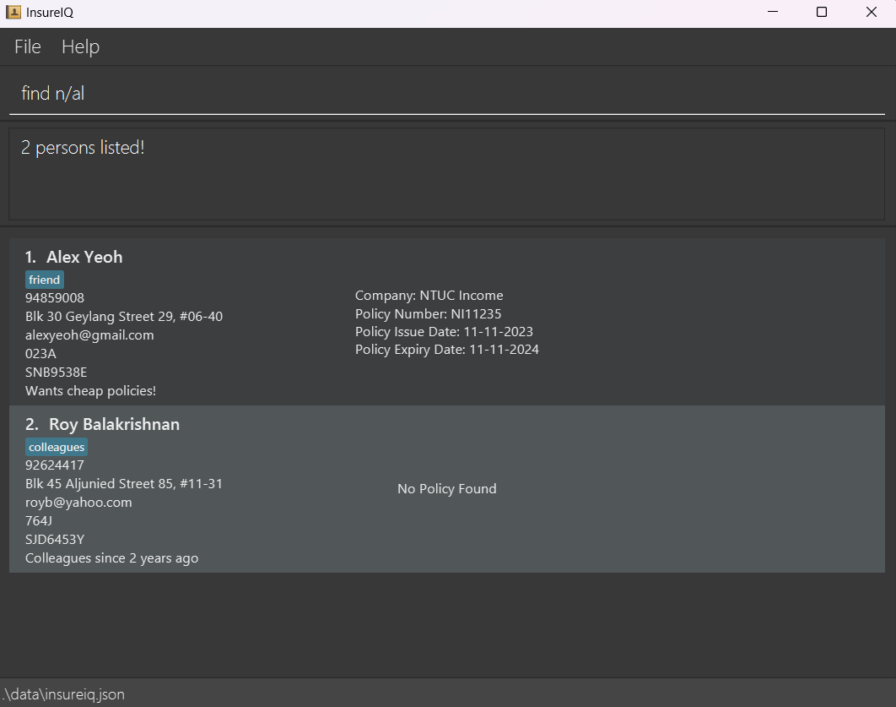
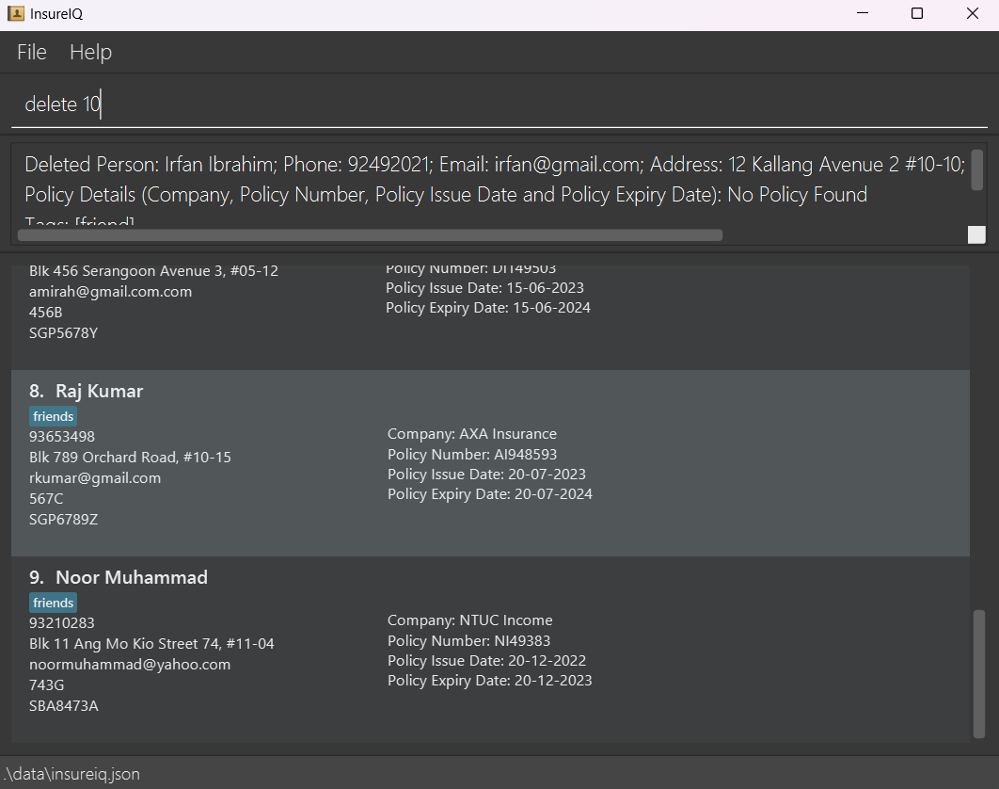
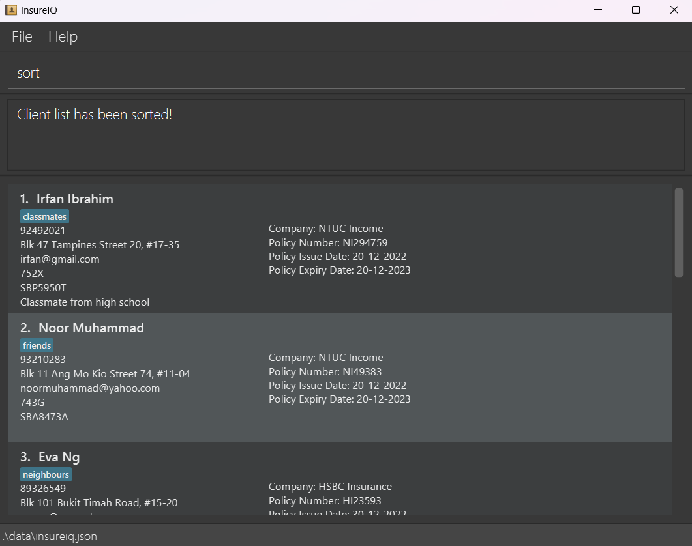
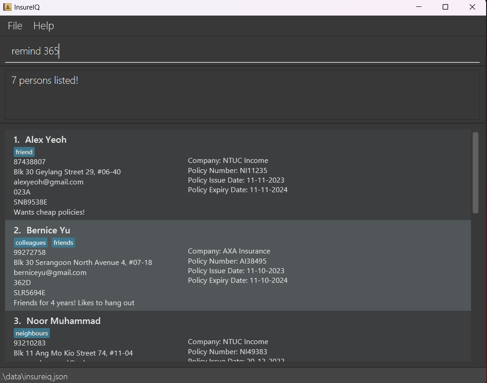

InsureIQ is a **contact management system for car insurance agents to keep track of multiple clients' details and policies** optimized for use via a Command Line Interface (CLI) while still having the benefits of a Graphical User Interface (GUI). If you can type fast, InsureIQ can get your contact management tasks done faster than traditional GUI apps.

* Table of Contents
{:toc}

--------------------------------------------------------------------------------------------------------------------

## Quick start

1. Ensure you have Java `11` or above installed in your Computer.

1. Download the latest `insureiq.jar` from [here](https://github.com/AY2324S1-CS2103T-W16-3/tp/releases/tag/v1.4).

1. Copy the file to the folder you want to use as the _home folder_ for InsureIQ.

1. Open a command terminal, `cd` into the folder you put the jar file in, and use the `java -jar insureiq.jar` command to run the application.<br>
   A GUI similar to the below should appear in a few seconds. Note how the app contains some sample data.<br>
   

1. Type the command in the command box and press Enter to execute it. e.g. typing **`help`** and pressing Enter will open the help window.<br>
   Some example commands you can try:

   * `list` : Lists all clients.

   * `delete 3` : Deletes the 3rd client shown in the current list.

   * `clear` : Deletes all clients.

   * `exit` : Exits the app.

1. Refer to the [Features](#features) below for details of each command.

--------------------------------------------------------------------------------------------------------------------

## Features

<div markdown="block" class="alert alert-info">

**:information_source: Notes about the command format:**<br>

* Words in `UPPER_CASE` are the parameters to be supplied by the user.<br>
  e.g. in `add n/NAME`, `NAME` is a parameter which can be used as `add n/John Doe`.

* Items in square brackets are optional.<br>
  e.g `n/NAME [t/TAG]` can be used as `n/John Doe t/friend` or as `n/John Doe`.

* Items with `…`​ after them can be used multiple times including zero times.<br>
  e.g. `[t/TAG]…​` can be used as ` ` (i.e. 0 times), `t/friend`, `t/friend t/family` etc.

* Parameters can be in any order.<br>
  e.g. if the command specifies `n/NAME p/PHONE_NUMBER`, `p/PHONE_NUMBER n/NAME` is also acceptable.

* Extraneous parameters for commands that do not take in parameters (such as `help`, `list`, `exit`, `sort` and `clear`) will be ignored.<br>
  e.g. if the command specifies `help 123`, it will be interpreted as `help`.

* If you are using a PDF version of this document, be careful when copying and pasting commands that span multiple lines as space characters surrounding line-breaks may be omitted when copied over to the application.
</div>

### Viewing help : `help`

Shows a message explaning how to access the help page.


Format: `help`


### Adding a client : `add`

Adds a client to the database.

Format: `add n/NAME i/NRIC p/CONTACT NUMBER e/EMAIL a/ADDRESS [t/TAG]... l/LICENCE PLATE [c/COMPANY
 pn/POLICY NUMBER pi/POLICY ISSUE DATE pe/POLICY EXPIRY DATE]`

* Add a client's details in the database.
* **All** client details **except tag** must be present when using this command.
* Tag is optional and this command allows multiple tags
* If adding a client’s policy, **all** policy details must be present when using this command.

Examples:
* `add n/Irfan Ibrahim i/752X p/92492021 e/irfan@example.com a/Blk 47 Tampines Street 20,#17-35 t/classmates l/SBP8888T` adds a client Irfan without a policy.
* `add n/Bob Anderson i/578A p/54783402 e/bobanderson@gmail.com a/Blk 233 Serangoon Avenue 3, #05-12 t/teacher l/SGP1208J c/DEF Insurance pn/263J pi/20-09-2023 pe/19-09-2024` adds a client Bob with the policy he buys.

Acceptable values for each parameter:
* `n/NAME`: Alphanumeric.
* `i/NRIC`: Alphanumeric, _exactly_ 4 characters (3 digits + 1 letter).
* `p/CONTACT NUMBER`: Numeric, _exactly_ 8 characters.
* `e/EMAIL`: Alphanumeric and/or special characters, no white spaces allowed, standard email format.
* `a/ADDRESS`: Alphabets and/or special characters, white spaces allowed.
* `t/TAG`: Alphabets, no white spaces allowed.
* `l/LICENCE PLATE`: Alphanumeric, _up to_ 8 characters.
* `c/COMPANY`: Alphabets and/or special characters, white spaces allowed.
* `pn/POLICY NUMBER`: Alphanumeric, _up to_ 8 characters.
* `pi/POLICY ISSUE DATE` and `pe/POLICY EXPIRY DATE`: Date in the format dd-mm-yyyy.

Expected output upon success: <br>


Expected output upon failure:
* Missing any of the compulsory fields:<br>
```
Invalid command format! 
Error: Some of the required fields are missing. 
Please include the following: - NRIC(i/) - Licence Plate(l/) 
```
* Incomplete policy details:<br>
```
Invalid command format! 
Please include either all or none of the policy variables. 
You are missing the following: - Policy Expiry Date(pe/)
```
* Adding a client with an existing policy number:<br>
```
Error: The policy number is already in use
```
* Adding a client that already exists:<br>
```
Error: This person already exists in the address book
```

<div markdown="block" class="alert alert-info">
**:information_source: Adding clients with duplicate fields:** The above error will only be raised when ALL fields are the same. This is to support clients with multiple insurance policies.

</div>


### Listing all clients : `list`

Shows a list of all clients in the database.

Format: `list`


### Editing a client : `edit`

Modify and/or updates existing policy information in the database.

Format: `edit INDEX [n/NAME] [i/NRIC] [p/CONTACT NUMBER] [e/EMAIL] [a/ADDRESS] [t/TAG]... [c/COMPANY] [l/LICENCE PLATE]
 [pn/POLICY NUMBER] [pi/POLICY ISSUE DATE] [pe/POLICY EXPIRY DATE]`

* Edits the client policy details at the specified `INDEX`. The index refers to the index number shown in the displayed person list. The index **must be a positive integer** 1, 2, 3, …​
* **At least one** of the optional fields must be provided.
* Existing values will be updated to the input values.

<div markdown="block" class="alert alert-info">
**:information_source: Important Notes about usage:**

* If you are adding a new policy number, you **must** also add the company, policy issue date and policy expiry date.
* In case of already existing policy, individual updates to the policy number, company, policy issue date and policy expiry date are allowed.
* To delete an existing policy from a user, you may use any one of the following (using more than one of the below, or using while updating another policy field will still result in the deletion of the policy)
  * `c/!@#NO_COMPANY!@#` or 
  * `pi/01-01-1000` or 
  * `pe/01-01-1000` or 
  * `pn/NO_POLICY`, as per the 'Format' mentioned above.

</div>


Examples:
*  `edit 1 l/SNB9876E` updates the policy at the INDEX number 1 with the new licence plate provided.
*  `edit 2 pn/AB12345J pe/31-12-2024` updates the policy at the INDEX number 2 with the new policy number and expiry date.
*  `edit 3 c/!@#NO_COMPANY!@#` deletes the policy at the INDEX number 3.
*  `edit 4 pn/AB12345J c/!@#NO_COMPANY!@#` deletes the policy at the INDEX number 4.
*  `edit 5 pn/NO_POLICY c/!@#NO_COMPANY!@# pe/01-01-1000` deletes the policy at the INDEX number 5.

Acceptable values for each parameter:
* `n/NAME`: Alphanumeric.
* `i/NRIC`: Alphanumeric, _exactly_ 4 characters (3 digits + 1 letter).
* `p/CONTACT NUMBER`: Numeric, _exactly_ 8 characters.
* `e/EMAIL`: Alphanumeric and/or special characters, no white spaces allowed, standard email format.
* `a/ADDRESS`: Alphabets and/or special characters, white spaces allowed.
* `t/TAG`: Alphabets, no white spaces allowed.
* `l/LICENCE PLATE`: Alphanumeric, _up to_ 8 characters.
* `c/COMPANY`: Alphabets and/or special characters, white spaces allowed.
* `pn/POLICY NUMBER`: Alphanumeric, _up to_ 8 characters.
* `pi/POLICY ISSUE DATE` and `pe/POLICY EXPIRY DATE`: Date in the format dd-mm-yyyy.

Expected output upon success: <br>


Expected output upon failure:
* Invalid command format:<br>
```
Invalid command format! 
edit: Edits the details of the person identified by the index number used in the displayed person list. Existing values will be overwritten by the input values.
Parameters: INDEX (must be a positive integer) [n/NAME] [p/PHONE] [e/EMAIL] [a/ADDRESS] [t/TAG]... [i/NRIC] [l/LICENCE_PLATE] [c/COMPANY] [pn/POLICY_NUMBER] [pi/POLICY_ISSUE_DATE] [pe/POLICY_EXPIRY_DATE] Example: edit 1 p/91234567 e/johndoe@example.com
```
* No specified `INDEX` or negative `INDEX` or no field provided:<br>
```
At least one field to edit must be provided. 
```


### Locating clients by fields : `find`

Finds client(s) whose fields matches any of the given fields.

Format: `find [n/NAME] [i/NRIC] [p/CONTACT NUMBER] [l/LICENCE PLATE] [e/EMAIL] [t/TAG]
[c/COMPANY] [pn/POLICY NUMBER] [pi/POLICY ISSUE DATE] [pe/POLICY EXPIRY DATE]`

* The search is case-insensitive e.g. `hans` will match `Hans`.
* The order of the fields does not matter. e.g. `find n/Hans i/123B` is the same as `find i/123B n/Hans`
* **At least one** of the fields must be present.
* Value given with white spaces for each field is treated as 1 value e.g. `find n/Hans Bo` will return clients with 
names `Hans Bo` in it.
* Clients that partially matches with the field given will be returned e.g. `find l/SLA` will return all clients whose
licence plates contains `SLA`.

Examples:
* `find n/mary` returns all clients that has the name `Mary` such as `Mary Lim`, `Mary Koh`, `Mary White`.
* `find n/Hans Bo` returns all clients that has the name `Hans Bo` but not those with only `Hans` or `Bo` in it.
* `find n/john pn/AB12345J` returns all clients whose name contains `John` with policy number `AB12345J`.

<div markdown="span" class="alert alert-info">:information_source: **Note:** The `find` command does not check for values of invalid format 
given in the different prefixes. Since any non-matching results will not be displayed, values of invalid format will also not display anything. </div>

Expected output upon success:<br>


Expected output upon failure:
* No field or invalid arguments given:
```
Invalid command format!  
find: Finds all persons whose names contain any of the specified fields (case-insensitive for values) and displays them as a list with index numbers.  
Parameters: [n/NAME] [l/LICENCE PLATE] [n/NAME] [i/NRIC] [p/CONTACT NUMBER] [l/LICENCE PLATE] [e/EMAIL] [c/COMPANY] [pn/POLICY NUMBER] [pi/POLICY ISSUE DATE] [pe/POLICY EXPIRY DATE]  
At least one parameter must be present.  
Example: find n/Alice Rodriguez
```
* Field prefix given but no value e.g. `n/ c/` :<br>
```
Error: No value detected for the following field(s): n/ c/
```

### Deleting a client : `delete`

Deletes the specified client from the database.

Format: `delete INDEX`

* Deletes the client at the specified `INDEX`.
* The index refers to the index number shown in the displayed list of clients and is a compulsory field.

Examples:
* `list` followed by `delete 2` deletes the 2nd client in the database.
* `find n/Betsy` followed by `delete 1` deletes the 1st client in the results of the `find` command.

Acceptable values for each parameter:
* `INDEX` : It must be a **must be a positive integer** 1, 2, 3, …​

Expected output upon success :


Expected output upon failure:
* Profile at the specified `INDEX` cannot be found:<br>
```
Error: Invalid Index
```
* Missing `INDEX` parameter:<br>
```
Error: Missing Index
```
* Incorrect `INDEX` parameter:<br>
```
Error: The parameter is not of the type positive integer
```


### Sorting clients by policy expiry date : `sort`

Format: `sort`

* Sorts the list from earliest to latest policy expiry date.
* People in the list with no policy data will be at the end of the sorted list.
* The parameter, if any, inputted after `sort` is ignored.

Examples:
* `sort` rearranges the displayed list to show which policies are expiring soonest.
* `find c/Google` followed by `sort` shows the policies expiring soonest in the results of the `find` command.

Expected output upon success :



### Remind user of clients policy expiry date : `remind`

Reminds the user of clients that have approaching policy expiry date within a certain number of days.

Format: `remind NUMBER_OF_DAYS`

* Filters the list based on policy expiry date that is within `NUMBER_OF_DAYS` from current date

Examples:
* `remind 30` returns the all clients with policy expiry date within 30 days from current date

Acceptable values for each parameter:
* `NUMBER_OF_DAYS` : Numeric, range from _0_ to _7305_

Expected output upon success (Current date is 12-11-2023):<br>


Expected output upon failure:
* `NUMBER_OF_DAYS` not in range _0_ to _7305_:<br>
```
Error: The value has to be between 0 and 7305 (both inclusive)
```
* `NUMBER_OF_DAYS` not numeric:<br>
```
Invalid command format! Error: The value is not a number
```
* `NUMBER_OF_DAYS` not given:
```
Invalid command format!  
remind: Finds all persons whose policy expiry dates is within the specified number of days.  
Parameters: Number of days  
Example: remind 30
```


### Add or remove remark to a client : `remark`

Adds or remove a remark to a client.

Format: `remark INDEX r/[REMARK]`

* `REMARK` is the remark that is going to be attached to the client
* `INDEX` refers to the index number shown in the displayed list of clients and is a compulsory field
* If `REMARK` is not given, it will remove the remark for the client at `INDEX`

Examples:
* `remark 1 r/Wants cheaper policies!` will attach the comment `Wants cheaper policies!` to the client that is at index `1`
* `remark 1` or `remark 1 r/` will remove the comment that is attached to client that is at index `1`

Acceptable values for each parameter:
* `INDEX` : It **must be a positive integer** 1, 2, 3, …​
* `REMARK` : Any characters

Expected output upon success:<br>


Expected output upon failure:
* Invalid `INDEX` parameter or no `INDEX` :<br>
```
Invalid command format!  
remark: Edits the remark of the person identified by the index number used in the last person listing. Existing remark will be overwritten by the input.
Parameters: INDEX (must be a positive integer) r/REMARK
Example: remark 1 r/Likes to swim.
```


### Batch delete clients: `batchdelete`

Batch delete clients with the specific condition.

Format: `batchdelete [c/COMPANY] [dm/DELETE MONTH]`

* Batch delete specific clients in the database.
* **Only one** of the optional fields must be provided.
* Clients that partially matches with the field given will be deleted e.g. `batchdelete c/NTUC` will delete all clients 
  who buy policy from companies `NTUC Company` and `NTUC Insurance`. 

Examples:
* `batchdelete dm/07-2020` batch delete clients whose policy expiry date is in July 2020.
* `batchdelete c/DEF Insurance` batch delete clients who buy policy from the company DEF Insurance.

Acceptable values for each parameter:
* `c/COMPANY`: Alphabets and/or special characters, white spaces allowed.
* `dm/DELETE MONTH`: Month in the format mm-yyyy.

Expected output upon success: <br>


<div markdown="span" class="alert alert-info">:information_source: **Note:** 
Even if no clients are deleted, 
InsureIQ will still show a confirmation message to let you know that the `batchdelete` command has been successfully processed.

</div>

Expected output upon failure:
* No field provided:<br>
```
Invalid command format! 
batchdelete: batch delete people whose policy: 
(i) expiry date is in the corresponding month and year OR 
(ii) belongs to a company.
(i) Parameter: dm/MM-yyyy
Example: batchdelete dm/11-2022
(ii) Parameter: c/COMPANY NAME
Example: batchdelete c/Allianz 
```
* Both fields exist:<br>
```
Error: Please contain only either one field of dm/ or c/.
```
* Incorrect format for delete month:<br>
```
Delete month should be in the format MM-yyyy
```


### Clearing all entries : `clear`

Clears all entries from the database.

Format: `clear`


### Exiting the program : `exit`

Exits the program.

Format: `exit`


### Saving the data

InsureIQ data are saved in the hard disk automatically after any command that changes the data. There is no need to save manually.


### Editing the data file

InsureIQ data are saved automatically as a JSON file `[JAR file location]/data/insureiq.json`. Advanced users are welcome to update data directly by editing that data file.

<div markdown="span" class="alert alert-warning">:exclamation: **Caution:**
If your changes to the data file makes its format invalid, InsureIQ will discard all data and start with an empty data file at the next run. Hence, it is recommended to take a backup of the file before editing it.
</div>

--------------------------------------------------------------------------------------------------------------------

## FAQ

**Q**: How do I transfer my data to another Computer?<br>
**A**: Install the app in the other computer and overwrite the empty data file it creates with the file that contains the data of your previous InsureIQ home folder.

--------------------------------------------------------------------------------------------------------------------

## Known issues

1. **When using multiple screens**, if you move the application to a secondary screen, and later switch to using only the primary screen, the GUI will open off-screen. The remedy is to delete the `preferences.json` file created by the application before running the application again.

--------------------------------------------------------------------------------------------------------------------

## Command summary

| Action          | Format, Examples                                                                                                                                                                                                                                                                            |
|-----------------|---------------------------------------------------------------------------------------------------------------------------------------------------------------------------------------------------------------------------------------------------------------------------------------------|
| **Add**         | `add n/NAME i/NRIC p/CONTACT NUMBER e/EMAIL a/ADDRESS [t/TAG]... l/LICENCE PLATE [c/COMPANY pn/POLICY NUMBER pi/POLICY ISSUE DATE pe/POLICY EXPIRY DATE]` <br> e.g., `add n/Irfan Ibrahim i/752X p/92492021 e/irfan@example.com a/Blk 47 Tampines Street 20,#17-35 t/classmates l/SBP8888T` |
| **Clear**       | `clear`                                                                                                                                                                                                                                                                                     |
| **Delete**      | `delete INDEX`<br> e.g., `delete 3`                                                                                                                                                                                                                                                         |
| **Edit**        | `edit INDEX [n/NAME] [i/NRIC] [p/CONTACT NUMBER] [e/EMAIL] [a/ADDRESS] [t/TAG]... [c/COMPANY] [l/LICENCE PLATE] [pn/POLICY NUMBER] [pi/POLICY ISSUE DATE] [pe/POLICY EXPIRY DATE]`<br> e.g.,`edit 2 n/Bernice Yeo p/88881111`                                                               |
| **Exit**        | `exit`                                                                                                                                                                                                                                                                                      |
| **Find**        | `find [n/NAME] [i/NRIC] [p/CONTACT NUMBER] [l/LICENCE PLATE] [e/EMAIL] [t/TAG] [c/COMPANY] [pn/POLICY NUMBER] [pi/POLICY ISSUE DATE] [pe/POLICY EXPIRY DATE]`<br> e.g. `find n/John pn/AB12345J`                                                                                            |
| **List**        | `list`                                                                                                                                                                                                                                                                                      |
| **Help**        | `help`                                                                                                                                                                                                                                                                                      |
| **Sort**        | `sort`                                                                                                                                                                                                                                                                                      |
| **Remind**      | `remind NUMBER_OF_DAYS`<br> e.g. `remind 30`                                                                                                                                                                                                                                                | 
| **Remark**      | `remark INDEX r/[REMARK]`<br> e.g. `remark 1 r/Likes to swim`                                                                                                                                                                                                                               |
 | **BatchDelete** | `batchdelete [c/COMPANY] [dm/DELETE MONTH]` <br> e.g. `batchdelete c/DEF Insurance`                                                                                                                                                                                                         |
